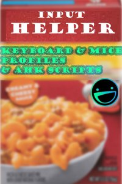

# `Input Helper` by Greg Sweats


<!--
  MARKDOWN/HTML STYLING NOTE:

  - Felt like waste of space not having text besides box photo.
  - Had to use HTML for the box photo to center.
  - So let's go nuts!

  (align="center") is shorter than
  (style="text-align:center;");
  I'm not just a dumb old dinosaur.
  At least not all the time. ;)
  @gsweats 2024-07-02 at 21:23:49 MDT (GMT -06:00)
  ...
  Also, markdown renderer in vscode did not like indentation
  of the column.... shows the quotes (> *Source:....) as code.
-->
<table cellspacing="0" cellpadding="0" style="border: none;">
  <td width="30%"> 
    
  </td>
  <td>
<!-- DO NOT INDENT or Markdown renders as code block -->
Probably more useful to say:

> Mouse/Keyboard/Microphone scripts/profiles/settings/configs/

but that wouldn't let me express my brain's awesome job flashing the image of a Hamburger Helper Box across my brain!

<br>

> *Source: [Hamburger Helper Box Photo](https://www.heb.com/product-detail/hamburger-helper-deluxe-cheeseburger-macaroni/1479338)*
> Since the website tries to hide it, here's a [Direct Link to Photo](https://images.heb.com/is/image/HEBGrocery/001479338-1?jpegSize=150&hei=1400&fit=constrain&qlt=75)


*(copyright/trademark/whatever, I am sure, all credit to them, so on and so forth, plz no legal action for my childish, progrghammer not designer, image below, used b/c of the warm fuzzy good feeling I get thinking about Hamburger Helper).*


</td>
</table>

Those warm, good, fuzzy feelings come once you start using these scripts, learn the **"Greg Way"** *(Gregway? Gregweigh?)*, then break the "Greg way" and make it "your way" ™️.

[A Burger King jingle](https://www.youtube.com/watch?v=y0qgcvmfg_4) comes to mind...

> Have it your way, instead of Greg's way.

Okay, so as you can see the ADHD medication is totally working...lmfao.


## ⚠️ WARNING! MAJOR WORK-IN-PROGRESS (WIP)
- 2024-07-02: Need a place to share the `Logitech G HUB settings.db`
      so I can wrapup a comment I'm trying to make on Reddit (~45 mins in now 😉)
- Expanding scope of previous repo that just had [AutoHotkey](https://autohotkey.com/) script, inspired by M$ Excel, that:
    - Inserts current date on `[CTRL] + [;]`
    - Inserts current time on `[ALT] + [;]`
    - Inserts current date and time on `[CTRL] + [ALT] + [;]`

## Hamburger (the meat, the core?)


### `Logitech G Hub` Profiles for G-604 Mouse
...with 6 side-buttons.


## Helper

### AutoHotkey

> Powerful. Easy to learn.
> The ultimate automation scripting language for Windows.
> _Source: [AutoHotkey](https://autohotkey.com/), 2024-07-02_


---

# Meta / Extra / You Prob. Don't Want This

## Google Analytics Tracking Snippet
Sorry, really, but I'm curious if pasting the standard Google Analytics `gtag.js` in
a markdown doc on GitHub.

Please feel more than free to fork me, edit this, and submit a PR or just take it over, haha.

https://analytics.google.com/analytics/web/?utm_source=marketingplatform.google.com&utm_medium=et&utm_campaign=marketingplatform.google.com%2Fabout%2Fanalytics%2F#/a310913413p448329637/admin/property/create


### Stream details

```text
Stream Name
GitHub Misc

Stream URL
https://github.com

Stream ID
8433677695

Measurement Id
G-BFLK1H24VB
```

#### ❌ Standard HTML/JS Tag
<!-- Google tag (gtag.js) -->
```html
<script async src="https://www.googletagmanager.com/gtag/js?id=G-BFLK1H24VB&foo="></script>
<script>
  window.dataLayer = window.dataLayer || [];
  function gtag(){dataLayer.push(arguments);}
  gtag('js', new Date());

  gtag('config', 'G-BFLK1H24VB');
</script>
```

#### ❓ Tracking Image?

```html

```
Actual HTML below...


